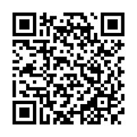

# NutriVision

Este é um projeto da faculdade chamado NutriVision que visa fornecer informações sobre alimentos adicionados. Este repositório contém o código HTML e o QR Code para a página web do projeto.

## Descrição

O projeto NutriVision tem como objetivo fornecer informações detalhadas sobre alimentos específicos. Nesta página web, você encontrará uma lista de alimentos adicionados, cada um com um link para obter mais informações sobre o alimento em questão. Até o momento, os seguintes alimentos estão disponíveis:

- Maçã
- Banana
- Laranja
- Morango
- Abacaxi

Ao clicar em um dos botões, você será redirecionado para uma página com informações detalhadas sobre o alimento selecionado.

### Autores:

- [@Kevin Souza](https://github.com/MrKevin284)
- [@Vittorio Augusto](https://github.com/vittorioaugusto)

## Uso

- Caso deseje acessar a página web diretamente, você pode usar o seguinte QR Code:
- Basta escanear o QR Code com um leitor de código QR em seu dispositivo móvel ou câmera para ser direcionado à página web.

 | [NutriVision](https://vittorioaugusto.github.io/NutriVision_prototipo/)
| --- | --- |

